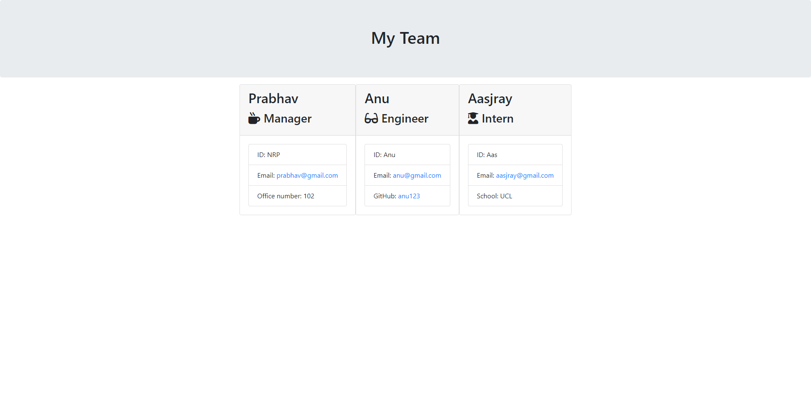

# Project-Team-Page-Generator

## Project Links
Deployed Link: https://github.com/nrprabhav/Project-Team-Page-Generator

Repository Link: https://nrprabhav.github.io/Project-Team-Page-Generator/

## Description
A javascript code that generates a HTML page with details of the project team from inputs in the command line.

## Features of the code
1. Inputs for the team manager are required.
2. You can choose to add interns and engineers to the project.
3. The inputs are validated to make sure that they are correct.
4. Once the details of the team have been entered the HTML page is generated - one card is generated for each team member.
5. The code is generated so that the tests in './__tests__' are passed.

## Installation
Run 'npm install'

## Outputs
The output HTML file is kept in the './output' folder

## Testing
The code can be tested using 'npm run test'.

## Dependencies
The code uses the following packages:
1. jest
2. inquirer
3. email-validator
The packages can be installed by doing the installation as detailed above.

## Screenshots

### Output HTML
